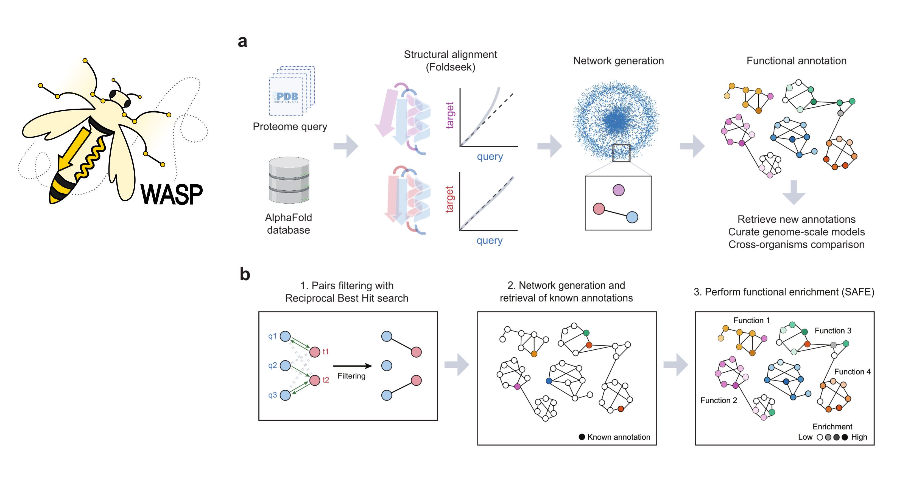

# WASP: Protein Functional Annotation using AlphaFold structures
  
This is the official repository for the paper [*WASP: A pipeline for functional annotation of proteins using AlphaFold structural models*](link). **WASP**, **<ins>W</ins>hole-proteome <ins>A</ins>nnotation through <ins>S</ins>tructural-homology <ins>P</ins>ipeline**, is a python-based command-line software designed for comprehensive organism annotation at the whole-proteome level based on structural homology.


<p  align="center">



</p>


If you find WASP helpful in your research, please cite us:

    @article{,
      author = {},
      title = {},
      journal = {},
      volume = {},
      number = {},
      pages = {},
      year = {},
      doi = {},
      URL = {}
    }  
]: #

## 1. Install

### 1.1 Requirements

Python >= 3.6; PyTorch >= 1.11.0; CUDA >= 10.1
Manuscript results were obtained using Python 3.10.14

### 1.2 Quickstart


```

cd WASP/
conda create -n WASP python==3.10 -y
conda activate WASP
pip install -r requirements.txt

```


